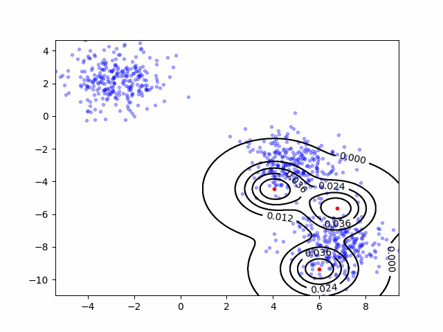
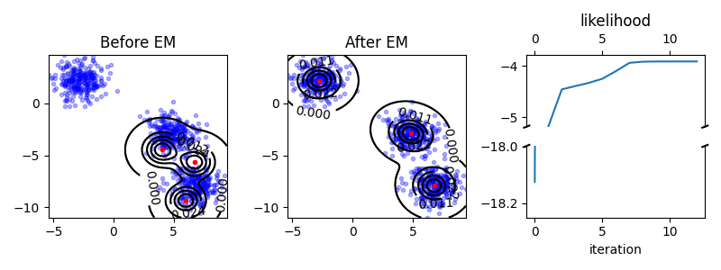

# Gaussian Mixed Model(GMMs)

Python implementation of GMMs

## Basic usage

  ```Python
  gmms = GMMs(data,k) # data [n_sample,n_var], k gaussian component number
  model.EM(init_method,n_iter_max,
           is_plot,fig_fpath,is_gif,gif_fpath)
  ''' init_method: method of initialing the center of Gaussian models,
  								 'random'
  								 'k_means'
  								 'norm_#': equally distributed along give axis
      n_iter_max: the maximum of iteration
      is_plot: whether plot the training result
      fig_fpath: file path where image to be saved
      is_gif: whether to plot the iteration process in gif
      gig_fpath: file path where gif to be saved
  '''
  ```


## Example

  ```Python
import numpy as np
from GMMs import GMMs
from sklearn.datasets import make_blobs


if __name__ == '__main__':
    X,Y = make_blobs(cluster_std=1, random_state=np.random.randint(100),
                     n_samples=800, centers=3)

    gmms = GMMs(x=X, k=3, max_iter=100, lh_theta=1e-5)
    gmms.EM(init_method='random',
            is_plot=True, fig_fpath='images/example.png',
            is_gif=True, gif_fpath='images/example.gif')

  ```
  Result:

  <table>
    <tr align=center>
      <td></td>
    </tr>
    <tr align=center>
      <td></td>
    </tr>
  </table>
